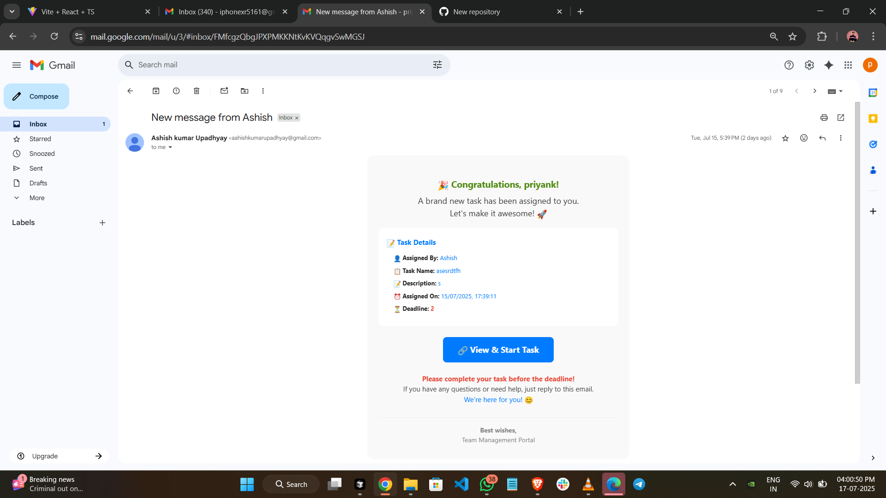

[🌐 **Live Developer Link**](https://update-emoplyee-task-mang.vercel.app/)

# 👋🚀 Team Task Management Portal

<p align="center">
  
</p>

<p align="center">
  
  
  
  
  
</p>

---

## 🌟 What is this Project?

> **Team Task Management Portal** is a modern platform where Admins can easily assign tasks to their team. Employees receive instant email notifications and can log in with just their email. The Admin can assign tasks to one, multiple, or all employees at once. The login process is super simple and fast!

---

## ✨ Features

- 🧑‍💼 **Admin Panel**
  - 🎯 Assign tasks to any one, multiple, or all employees
  - ⏰ Set deadlines and descriptions
  - 🔐 Secure login (password for Admin)

- 👨‍💻 **Employee Portal**
  - 📧 Employees log in using only their email (no password required)
  - ⚡ Instantly view assigned tasks
  - 📨 Receive email notifications for new tasks

- 📬 **Email Notification**
  - Employees receive a beautiful email with complete task details and a direct link

- 🚀 **Fast & Easy**
  - Super simple login for employees
  - Secure password for Admin

---

## 📸 Screenshots

### 🎉 Example of Email Notification
<p align="center">
  
</p>

---

## 🛠️ How Does It Work?

1. 🔑 **Admin logs in** using their password.
2. 📝 **Admin assigns tasks** to one, multiple, or all employees.
3. 📩 **Employees receive an email** with task details and a direct link.
4. 👤 **Employees log in** using their email (no password needed).
5. 📋 **Employees view and manage their tasks** from the dashboard.

---

## 🔒 Authentication

- **Admin:** Logs in with a password.
- **Employee:** Logs in using only the email provided by the admin.

---

## 🚦 Quick Start

```bash
# Clone the repository
git clone https://github.com/yourusername/your-repo.git

# Install dependencies
cd update-emoplyee-task-mang
npm install

# Start the development server
npm run dev
```

---

## 💡 Tech Stack

<p align="center">
  
  
  
  
</p>

---

## 🤝 How to Contribute?

If you want to add something new, please send a pull request! For major changes, open an issue first.

---

## 📧 Contact

For any help, contact the admin or open an issue.<br>
Email: [ashishkumarupadhyay@0328@gmail.com](mailto:ashishkumarupadhyay@0328@gmail.com)

---

> <p align="center"><b>Let's make team management awesome and easy! 🚀✨</b></p>
